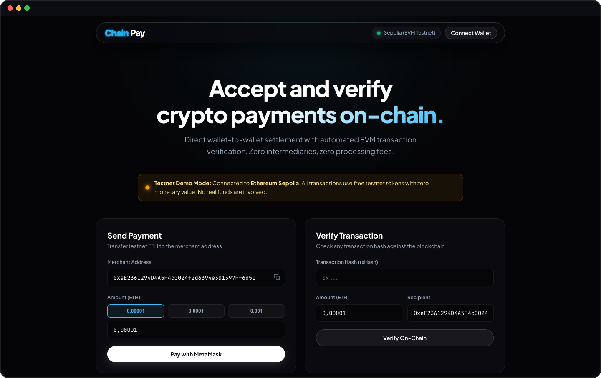

<p align="center">
  
</p>

<p align="center">
  <strong>Lightweight EVM crypto payment gateway and transaction verification API.</strong>
</p>

<p align="center">
  <a href="#-key-features--technical-highlights">Features & Tech</a> •
  <a href="#-prerequisites">Prerequisites</a> •
  <a href="#-quick-start-local">Quick Start</a> •
  <a href="#-deploy-online-in-3-minutes-free">Deploy Online</a> •
  <a href="#%EF%B8%8F-web-dashboard-tour">Web Dashboard</a> •
  <a href="#-api-reference">API Docs</a> •
  <a href="#-who-is-chainpay-for">Use Cases</a>
</p>

<p align="center">
  <a href="https://chainpay-xhl0.onrender.com" target="_blank">
    
  </a>
</p>

<p align="center">
  
  
  
  
  
</p>

<p align="center">
  
</p>

---

> [!NOTE]
> **Testnet Demonstration**: By default, this live deployment and repository operate on the **Ethereum Sepolia Testnet** using free test tokens. No real funds or real currency are involved or required.

## ⚡ Key Features & Technical Highlights

ChainPay is an open-source, non-custodial payment gateway engineered for Ethereum and EVM-compatible networks (Base, Polygon, Arbitrum, Optimism).

```text
Payment & Verification Architecture:
[Client / MetaMask Wallet]
         │
         ▼  (1) Broadcast signed tx (eth_sendTransaction)
[EVM Blockchain] ◄────── (2) Mined into block (e.g. Block #5839210)
         ▲
         │  (4) Query JSON-RPC (eth_getTransactionByHash + eth_getTransactionReceipt)
[ChainPay Backend] ◄────── (3) POST /api/tx { txHash, amount, to }
         │
         ▼
[Settled Ledger] ──────► (5) HTTP 200 { status: "confirmed" }
```

- **Zero-Fee Non-Custodial Transfers**: Direct peer-to-peer settlement from customer wallet to merchant wallet. Zero gateway percentage cuts, zero chargeback risks, and no third-party custodial fund holding.
- **Direct On-Chain Verification (`POST /api/tx`)**: Queries raw EVM JSON-RPC state rather than trusting third-party webhooks, independently confirming sender, recipient, and amount.
- **Lossless BigInt Wei Arithmetic**: All payment values are parsed and evaluated using native 256-bit `BigInt` Wei ($10^{18}$) via `ethers.parseEther`, eliminating JavaScript IEEE-754 floating-point rounding vulnerabilities.
- **EIP-55 Checksum Normalization**: Automatic address casing resolution through `ethers.getAddress` prevents checksum spoofing and case-sensitive comparison bugs.
- **Reorg & Revert Protection**: Enforces mined block inclusion via `provider.waitForTransaction()` and validates EVM receipt execution status (`receipt.status === 1`) before settling orders.
- **Deep Module Architecture**: Blockchain polling, retry intervals, and hex conversions are encapsulated inside a cohesive `PaymentService` (`src/services/paymentService.js`), keeping routes and controllers featherweight.
- **Turnkey Web3 Dashboard**: Out-of-the-box dark-themed UI served on `/` featuring 1-click MetaMask checkout, real-time block height polling, and a live settled payments ledger.

---

## 🧰 Prerequisites

You do not need any real money to test and run ChainPay! Everything runs on the **Sepolia EVM testnet** using free test tokens.

| Prerequisite              | Purpose                                                  | Where to get it (100% Free)                                                                                                                                                             |
| :------------------------ | :------------------------------------------------------- | :-------------------------------------------------------------------------------------------------------------------------------------------------------------------------------------- |
| **Node.js (v18+)**        | Runtime to execute the server.                           | [nodejs.org](https://nodejs.org/)                                                                                                                                                       |
| **MetaMask Wallet**       | Browser extension to hold test tokens and sign payments. | [metamask.io](https://metamask.io/)                                                                                                                                                     |
| **Free Sepolia Test ETH** | Fictional test currency used to make test payments.      | • [Google Cloud Web3 Sepolia Faucet](https://cloud.google.com/application/web3/faucet/ethereum/sepolia)<br>• [Alchemy Sepolia Faucet](https://www.alchemy.com/faucets/ethereum-sepolia) |
| **RPC Endpoint**          | API URL allowing your server to query the blockchain.    | Free accounts at [Alchemy.com](https://www.alchemy.com/) or [Infura.io](https://infura.io/)                                                                                             |

---

## 🚦 Quick Start (Local)

### 1. Clone & Install

```bash
git clone https://github.com/baptiste1307/Crypto_Payment_Integration.git chainpay
cd chainpay
npm install
```

### 2. Environment Configuration

Copy the template configuration:

```bash
cp .env.example .env
```

Edit your `.env` file:

```env
# Alchemy, Infura, or any EVM RPC endpoint (Sepolia testnet recommended)
RPC_URL="https://eth-sepolia.g.alchemy.com/v2/YOUR_API_KEY"

# Merchant recipient wallet address (where payments are sent)
DEFAULT_RECIPIENT="0x445Aaae218d736acD1658c31B09Fe0263f466965"

# Server Port (defaults to 3001)
PORT=3001
```

### 3. Start the Server

```bash
# Production mode
npm start

# Development mode (with auto-reload on code change)
npm run dev
```

Open your browser at **[http://localhost:3001](http://localhost:3001)** to see the Web3 Dashboard!

---

## 🌐 Deploy Online in 3 Minutes (Free)

> **You do NOT need to keep this running only on your computer!**  
> Anyone on the internet can test your live Web3 payment dashboard by deploying it to a free cloud hosting provider like [Render](https://render.com/).

### Step-by-Step Deployment on Render.com:

1. Push your repository to your **GitHub** profile.
2. Sign up / Log in to **[Render.com](https://render.com/)**.
3. Click **New +** and select **Web Service**.
4. Connect your GitHub repository (`Crypto_Payment_Integration`).
5. Configure the service:
   - **Name**: `chainpay-live`
   - **Language**: `Node`
   - **Branch**: `main`
   - **Build Command**: `npm install`
   - **Start Command**: `npm start`
   - **Instance Type**: `Free`
6. Under **Environment Variables**, add:
   - `RPC_URL` : Your Alchemy or Infura Sepolia RPC URL
   - `DEFAULT_RECIPIENT` : Your Ethereum wallet address
7. Click **Deploy Web Service**.

Render will build and serve your app with a free HTTPS URL: **[https://chainpay-xhl0.onrender.com](https://chainpay-xhl0.onrender.com)**, making your payment dashboard accessible to anyone in the world!

---

## 🖥️ Web Dashboard Tour

When navigating to the dashboard, users and merchants have access to:

1. **Live Network Pulse**: Real-time Sepolia block height indicator and health check status.
2. **1-Click MetaMask Checkout**: Preset amount chips (0.001 ETH, 0.005 ETH, etc.) and instant transaction broadcast via window.ethereum.
3. **Automatic Inspector**: Automatically fills the transaction hash upon broadcast and queries the verification endpoint.
4. **Settled Payments Ledger**: Real-time table displaying recent payments with timestamps, block numbers, and direct links to Sepolia Etherscan.

---

## 📡 API Reference

### 1. Verify Payment

- **Method**: `POST`
- **Route**: `/api/tx`
- **Payload**:
  ```json
  {
    "txHash": "0x5a2d8f9b...",
    "amount": 0.001,
    "to": "0x445Aaae218d736acD1658c31B09Fe0263f466965"
  }
  ```
- **Response (`200 OK`)**:
  ```json
  {
    "status": "confirmed",
    "message": "Payment verified and confirmed on-chain.",
    "payment": {
      "txHash": "0x5a2d8f9b...",
      "from": "0x70997970C51812dc3A010C7d01b50e0d17dc79C8",
      "to": "0x445Aaae218d736acD1658c31B09Fe0263f466965",
      "amount": "0.001",
      "blockNumber": 5839210,
      "confirmations": 1,
      "timestamp": "2026-09-20T15:20:00.000Z",
      "status": "confirmed"
    }
  }
  ```

### 2. View Settled Payments

- **Method**: `GET`
- **Route**: `/api/payments`
- Returns the list of all verified payments recorded during the server runtime.

### 3. Node & Network Health

- **Method**: `GET`
- **Route**: `/api/health`
- Returns network name, current block height, chain ID, and RPC status.

---

## 💡 Why ChainPay? Who is this for?

| Target Audience                  | Why They Care                                                                                                            |
| :------------------------------- | :----------------------------------------------------------------------------------------------------------------------- |
| **Indie Hackers & Solo SaaS**    | Want to accept payments worldwide without opening a registered company or paying 3% Stripe fees.                         |
| **P2P Creators & Donors**        | Free, open-source alternative to "Buy Me a Coffee" or Patreon with zero platform cuts.                                   |
| **Web3 Developers & Recruiters** | Clean, production-grade example of Ethers.js v6, JSON-RPC queries, precision math, and Ousterhout software architecture. |

---

## 📄 License

Distributed under the MIT License. Built with ❤️ by [baptiste1307](https://github.com/baptiste1307).
